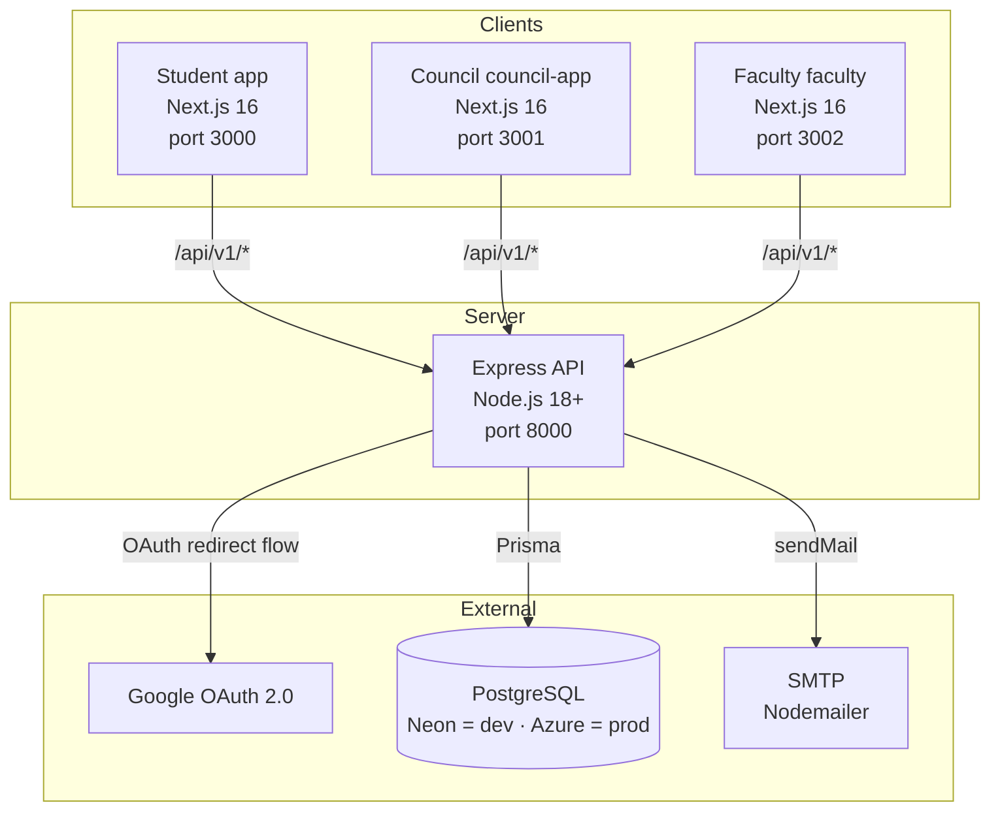

# Eventio 3.0


> Full-stack college event management platform with role-based access for students, councils, faculty, and the principal.

**New here or coming back after a break? Read [`SETUP.md`](SETUP.md) for the step-by-step local + deployed run guide.**
**AI agents / Claude Code: read [`AGENTS.md`](AGENTS.md) first** for the repo map and hard rules (e.g. which frontends are dead code).

---

## Table of Contents

- [What is this Project?](#what-is-this-project)
- [Active vs Deprecated Folders](#active-vs-deprecated-folders)
- [Architecture Overview](#architecture-overview)
- [Tech Stack](#tech-stack)
- [Project Structure](#project-structure)
- [Quick Start](#quick-start)
- [Ports](#ports)
- [Environment Variables](#environment-variables)
- [Auth Flow](#auth-flow)
- [API Reference Summary](#api-reference-summary)
- [Contributing](#contributing)
- [License](#license)

---

## What is this Project?

Eventio 3.0 is a college event management system built for Somaiya University. Student councils create and manage events (competitions, workshops, speaker sessions, fests), handle team-based or solo registrations, collect fees, mark attendance, and generate PDF attendance reports. Faculty and the Principal review and approve events through a dedicated portal. Students discover and register for events through a PWA-enabled student portal.

Authentication is exclusively **Google OAuth 2.0**, domain-restricted to `somaiya.edu` in production. Five roles (`USER`, `COUNCIL`, `FACULTY`, `PRINCIPAL`, `ADMIN`) drive access control across the three frontends.

---

## Active vs Deprecated Folders

> ⚠️ The `frontend/` directory contains **6** apps. Only **3 are active**. The other 3 are
> obsolete Vite SPAs kept for reference only — **do not run, edit, or copy from them.**

| Folder | Status | Role | Stack |
|---|---|---|---|
| `backend/` | ✅ active | REST API, auth, Prisma, PDF, email | Express 4 (Node 18+) |
| `frontend/app/` | ✅ active | **Student** portal (PWA) | Next.js 16 App Router |
| `frontend/council-app/` | ✅ active | **Council** management portal | Next.js 16 App Router |
| `frontend/faculty/` | ✅ active | **Faculty / Principal** portal | Next.js 16 App Router |
| `frontend/student/` | ❌ deprecated | old student SPA | Vite (dead) |
| `frontend/council/` | ❌ deprecated | old council SPA | Vite (dead) |
| `frontend/dean/` | ❌ deprecated | old dean SPA | Vite (dead) |

---

## Architecture Overview



---

## Tech Stack

### Services

| Service | Language | Runtime | Framework | Role | Dev Port |
|---|---|---|---|---|---|
| `backend` | JavaScript | Node.js 18+ | Express 4 | REST API, Auth, PDF, Email | 8000 |
| `frontend/app` | TypeScript | Browser | Next.js 16 + React 19 | Student portal (PWA) | 3000 |
| `frontend/council-app` | TypeScript | Browser | Next.js 16 + React 19 | Council portal | 3001 |
| `frontend/faculty` | TypeScript | Browser | Next.js 16 + React 19 | Faculty / Principal portal | 3002 |

### Infrastructure

| Component | Technology | Purpose |
|---|---|---|
| Dev database | PostgreSQL — **Neon** serverless | Local / test data (Neon adapter, WebSocket) |
| Prod database | PostgreSQL — **Azure** | Deployed data (`pg` adapter over TCP) |
| ORM | Prisma 5 (driver adapters) | Auto-selects Neon vs `pg` from `DATABASE_URL` |
| Auth | Google OAuth 2.0 (Passport, redirect flow) | Login for all three apps |
| Reverse proxy (prod) | Nginx | Serves SPAs + proxies `/api/` (see `DOCKER_README.md`) |
| Email | Nodemailer (SMTP) | Transactional emails |
| PDF | PDFKit | Attendance reports |
| Logging | Bunyan | Structured JSON logs |

> The Prisma client (`backend/utils/prisma_client.js`) inspects `DATABASE_URL`: a `neon.tech`
> host uses the Neon serverless adapter; any other host uses plain `pg`. Swap the URL to swap DBs.

---

## Project Structure

```
eventio-3.0/
├── backend/                     # Express API (the only backend)
│   ├── main.js                  # Entry point, Passport/OAuth, route mounting, CORS, rate limits
│   ├── prisma/
│   │   ├── schema.prisma        # Data models & enums (datasource uses DATABASE_URL only)
│   │   └── migrations/          # Prisma migration history
│   ├── routes/                  # auth, user, event, council, mailer, document, budget, announcement
│   ├── middleware/              # auth.middleware.js (JWT), field-validator.middlware.js
│   └── utils/                   # prisma_client.js, logger, mailer, faculty-access
├── frontend/
│   ├── app/                     # ✅ Student portal      (Next.js 16, PWA)   → :3000
│   ├── council-app/             # ✅ Council portal       (Next.js 16)        → :3001
│   ├── faculty/                 # ✅ Faculty/Principal     (Next.js 16)       → :3002
│   ├── student/  council/  dean/  # ❌ deprecated Vite SPAs — ignore
├── AGENTS.md / CLAUDE.md        # Context & rules for AI agents
├── SETUP.md                     # Full local + deployed run guide
├── DEPLOY.md / DOCKER_README.md # Production deploy notes (Docker/Nginx)
├── docker-compose.yml
└── example.env                  # Backend env template (see also backend/.env.example)
```

---

## Quick Start

Prerequisites: **Node.js 18+** and npm. See [`SETUP.md`](SETUP.md) for the full walkthrough,
the Google OAuth Console step, and Playwright/automation notes.

### 1. Backend

```bash
cd backend
cp .env.example .env         # then fill in values (DATABASE_URL, Google creds, secrets)
npm install
npx prisma generate          # required — schema uses the driverAdapters preview
npx prisma migrate deploy    # apply migrations (point DATABASE_URL at the Neon dev DB)
node main.js                 # http://localhost:8000
```

Health check: <http://localhost:8000/api/v1/health>

### 2. Frontends (each in its own terminal)

Each app needs a `.env.local` (copy from its `.env.example`). ⚠️ `app` and `faculty` **fall back
to the production API** if `NEXT_PUBLIC_SERVER_ADDRESS` is unset — always set it locally.

```bash
# Student
cd frontend/app         && cp .env.example .env.local && npm install && npm run dev -- -p 3000
# Council
cd frontend/council-app && cp .env.example .env.local && npm install && npm run dev -- -p 3001
# Faculty
cd frontend/faculty     && cp .env.example .env.local && npm install && npm run dev -- -p 3002
```

---

## Ports

| App | URL | Backend env that must point here |
|---|---|---|
| Backend API | http://localhost:8000 | `SERVER_URL` |
| Student (`app`) | http://localhost:3000 | `CLIENT_URL` |
| Council (`council-app`) | http://localhost:3001 | `COUNCIL_CLIENT_URL` |
| Faculty (`faculty`) | http://localhost:3002 | `FACULTY_CLIENT_URL` (+ `DEAN_CLIENT_URL`) |

The backend redirects post-login **by role** to these URLs and uses the same three as its CORS
allowlist — so the ports here must match `backend/.env` exactly. See [Auth Flow](#auth-flow).

---

## Environment Variables

### Backend (`backend/.env`) — see `backend/.env.example`

| Variable | Description | Required |
|---|---|---|
| `DATABASE_URL` | PostgreSQL connection string. Neon host → Neon adapter; else `pg`. | Yes |
| `NODE_ENV` | `production` enables the `somaiya.edu` domain lock. Leave unset locally. | No |
| `PORT` | Backend listen port (default `8000`). | No |
| `LOG_LEVEL` | Bunyan level (`trace`…`error`). | No |
| `GOOGLE_CLIENT_ID` / `GOOGLE_CLIENT_SECRET` | Google OAuth 2.0 credentials. | Yes |
| `GOOGLE_CALLBACK_URL` | Callback path appended to `SERVER_URL` (`/api/v1/auth/google/callback`). | No |
| `FRONTEND_REDIRECT_PATH` | Path appended on post-login redirect (`/login`). | No |
| `JWT_SECRET` | Signs access + refresh tokens. | Yes |
| `SESSION_SECRET` | Express session secret. | Yes |
| `AT_EXPIRATION` / `RT_EXPIRATION` | Token lifetimes (`5h` / `7d`). | No |
| `CLIENT_URL` | Student app origin — default post-login redirect + CORS. | Yes |
| `COUNCIL_CLIENT_URL` | Council app origin — `COUNCIL` redirect + CORS. | Yes |
| `FACULTY_CLIENT_URL` | Faculty app origin — `FACULTY`/`PRINCIPAL` redirect + CORS. | Yes |
| `DEAN_CLIENT_URL` | Legacy fallback for `FACULTY_CLIENT_URL`. | No |
| `SERVER_URL` | Public backend URL (builds the OAuth callback). | Yes |
| `EMAIL_USER` / `EMAIL_PASS` | SMTP creds for Nodemailer. | Email features only |

> `DIRECT_URL` is **not** used — `schema.prisma`'s datasource reads only `DATABASE_URL`.

### Frontends (`frontend/<app>/.env.local`) — see each `.env.example`

| Variable | Description | Apps |
|---|---|---|
| `NEXT_PUBLIC_SERVER_ADDRESS` | Backend base URL (client calls `${it}/api/v1`). | all three |
| `NEXT_PUBLIC_APP_URL` | Public URL of the student app (metadata/absolute links). | `app` only |

---

## Auth Flow

1. A frontend sends the browser to `${NEXT_PUBLIC_SERVER_ADDRESS}/api/v1/auth/google`.
2. The **backend** runs the Google handshake. Google's redirect URI is
   `SERVER_URL + /api/v1/auth/google/callback` — the callback lands on the **backend**.
3. The backend redirects back **by the user's role**, appending `/login?accessToken=…&refreshToken=…`:
   - `USER` (default) → `CLIENT_URL`
   - `COUNCIL` → `COUNCIL_CLIENT_URL`
   - `FACULTY` / `PRINCIPAL` → `FACULTY_CLIENT_URL`
4. Each app stores tokens in `localStorage` under **app-specific keys**:

| App | Access token key | Refresh token key |
|---|---|---|
| `app` | `accessToken` | `refreshToken` |
| `council-app` | `council_accessToken` | `council_refreshToken` |
| `faculty` | `faculty_accessToken` | `faculty_refreshToken` |

The `somaiya.edu` domain restriction applies **only** when `NODE_ENV=production`, so a plain Google
account works locally. To add localhost login, add `http://localhost:8000/api/v1/auth/google/callback`
as an authorized redirect URI on the Google OAuth client (details in [`SETUP.md`](SETUP.md)).

---

## API Reference Summary

All routes are prefixed `/api/v1`. Routes containing `/p/` require a `Bearer <accessToken>` header.

| Route group | Base | Purpose |
|---|---|---|
| health | `/health` | Liveness probe |
| auth | `/auth` | Google OAuth (`/google`, `/google/callback`), token exchange & refresh |
| user | `/user` | Profile read/update |
| event | `/event` | Event CRUD, registration, teams, attendance, tickets, reports, state changes |
| council | `/council` | List council members |
| mailer | `/mailer` | Send transactional email |
| document | `/document` | Council/event document management |
| budget | `/budget` | Event budget management |
| announcement | `/announcement` | Announcements |

> Rate limits (`backend/main.js`): global 300 req/min per IP; auth endpoints 30 per 15 min.

---

## Contributing

1. Branch off `main`: `git checkout -b feat/your-feature`.
2. Work **only** in the active apps (`backend/`, `frontend/app`, `frontend/council-app`, `frontend/faculty`).
   The deprecated Vite folders are off-limits.
3. Backend: follow the existing route/middleware pattern; log errors with the Bunyan logger.
4. Frontend: TypeScript strict; Prettier + ESLint (`npm run lint`); Tailwind utilities. These apps
   run **Next.js 16** — check `frontend/<app>/AGENTS.md`; APIs differ from older Next.js.
5. Do not commit secrets. Open a PR against `main`.

---

## License

MIT
