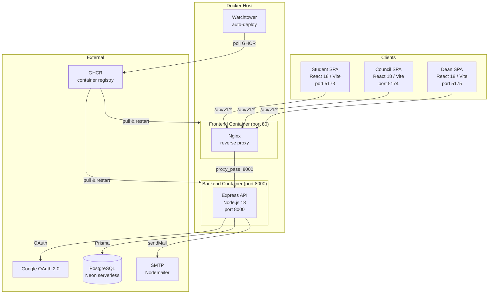
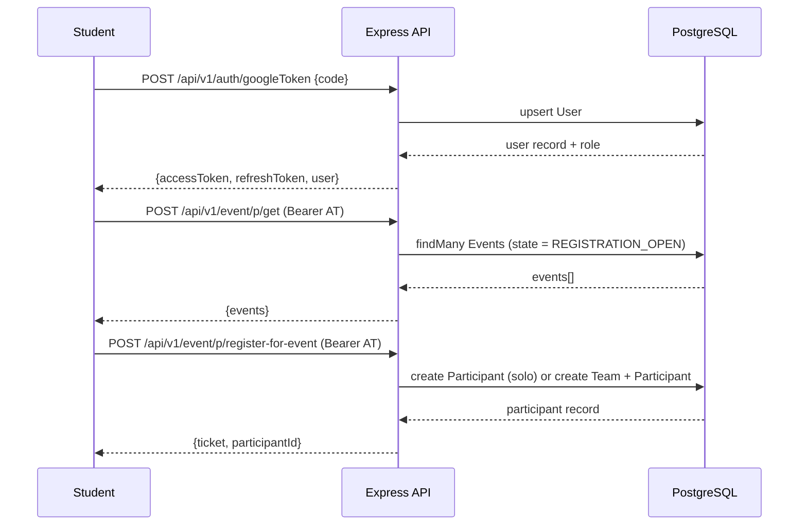

# Eventio 3.0


> Full-stack college event management platform with role-based access for students, councils, faculty, and the principal.

---

## Table of Contents

- [What is this Project?](#what-is-this-project)
- [Architecture Overview](#architecture-overview)
- [Core Flow](#core-flow)
- [Tech Stack](#tech-stack)
- [Project Structure](#project-structure)
- [Quick Start](#quick-start)
- [API Reference Summary](#api-reference-summary)
- [Environment Variables](#environment-variables)
- [Development Tools](#development-tools)
- [Contributing](#contributing)
- [License](#license)

---

## What is this Project?

Eventio 3.0 is a college event management system built for Somaiya University. It lets student councils create and manage events (competitions, workshops, speaker sessions, fests), handle team-based or solo registrations, collect fees, mark attendance via tickets or BLE, and generate PDF attendance reports. Faculty and the Principal can review and approve events through a dedicated dean portal. Students discover and register for events through a PWA-enabled student portal.

Authentication is exclusively Google OAuth 2.0, with domain-restriction to `somaiya.edu` in production. Five distinct roles (USER, COUNCIL, FACULTY, PRINCIPAL, ADMIN) drive fine-grained access control across all three frontends.

---

## Architecture Overview



---

## Core Flow

### Event Registration (Happy Path)



### Failure / Compensation

| Failure Point | Compensating Event | Compensating Action |
|---|---|---|
| Google token invalid | 401 Unauthorized | Client discards tokens, redirects to login |
| Access token expired | 401 from `authCheck` | Client calls `POST /auth/refresh-token` with refresh token |
| Refresh token expired | 401 from refresh route | Client forces full re-login |
| Event registration fails (DB error) | 500 Internal Server Error | Participant record is not created; client shows error |
| Team invite code collision | DB unique constraint violation | Server retries code generation |

---

## Tech Stack

### Services

| Service | Language | Runtime | Framework | Database | Role | Port |
|---|---|---|---|---|---|---|
| backend | JavaScript | Node.js 18 | Express 4 | PostgreSQL (Neon via Prisma) | REST API, Auth, PDF, Email | 8000 |
| frontend/student | TypeScript | Browser | React 18 + Vite | — | Student portal (PWA) | 5173 |
| frontend/council | TypeScript | Browser | React 18 + Vite | — | Council management portal | 5174 |
| frontend/dean | TypeScript | Browser | React 18 + Vite | — | Faculty / Principal portal | 5175 |

### Infrastructure

| Component | Technology | Purpose |
|---|---|---|
| Database | PostgreSQL (Neon serverless) | Primary data store via `@neondatabase/serverless` + Prisma |
| Reverse proxy | Nginx (alpine) | Serves all three SPAs, proxies `/api/` to backend |
| Container orchestration | Docker Compose | Local and production deployment |
| Auto-deploy | Watchtower | Polls GHCR every 300 s, pulls new images, restarts containers |
| Container registry | GitHub Container Registry (GHCR) | Hosts `eventio-backend` and `eventio-frontend` images |
| Email | Nodemailer (SMTP) | Transactional emails |
| PDF generation | PDFKit | Attendance reports |
| WebSocket | `ws` | Real-time event activity |
| Logging | Bunyan + bunyan-middleware | Structured JSON request/app logging |

---

## Project Structure

```
eventio-3.0/
├── backend/                     # Express API
│   ├── main.js                  # App entry point, Passport setup, route mounting
│   ├── dockerfile               # Backend container image
│   ├── prisma/
│   │   ├── schema.prisma        # Data models: Events, User, Participant, Team, Admins
│   │   └── migrations/          # Prisma migration history
│   ├── routes/
│   │   ├── auth.route.js        # Google OAuth, token exchange, refresh
│   │   ├── event.route.js       # Event CRUD, registration, teams, attendance
│   │   ├── user.route.js        # Profile read/update
│   │   ├── council.route.js     # List council members
│   │   └── mailer.route.js      # Send transactional email
│   ├── middleware/
│   │   ├── auth.middleware.js   # JWT verification, attaches req.user
│   │   └── field-validator.middlware.js  # Event update field allowlist
│   └── utils/
│       ├── prisma_client.js     # Prisma client singleton (Neon adapter)
│       ├── logger.js            # Bunyan logger instance
│       ├── logger_middleware.js # HTTP request logging middleware
│       ├── mailer.js            # Nodemailer transport
│       └── nmail.js             # Email helper wrapper
├── frontend/
│   ├── student/                 # Student-facing SPA (React 18, PWA)
│   ├── council/                 # Council management SPA (React 18)
│   └── dean/                    # Faculty / Principal SPA (React 18)
├── Dockerfile                   # Multi-stage: builds all 3 SPAs → Nginx image
├── docker-compose.yml           # backend + frontend + watchtower services
├── nginx.conf                   # Nginx config: SPA routing, API proxy, rate limiting
├── example.env                  # Environment variable template
└── ssl/                         # TLS certificate mount point
```

---

## Quick Start

### Prerequisites

| Tool | Min Version | Install |
|---|---|---|
| Docker | 24 | https://docs.docker.com/get-docker/ |
| Docker Compose | 2.x | Bundled with Docker Desktop |
| Node.js | 18 | https://nodejs.org/ (dev only) |

### Production (Docker Compose)

1. Clone the repository:
   ```bash
   git clone https://github.com/csikjsce/eventio-3.0.git
   cd eventio-3.0
   ```

2. Copy the environment template and fill in all required values:
   ```bash
   cp example.env .env
   ```

3. Pull and start all containers:
   ```bash
   docker compose pull
   docker compose up -d
   ```

4. Verify the stack is healthy:
   ```bash
   curl http://localhost/api/v1/health
   ```

### Local Development

1. **Backend**:
   ```bash
   cd backend
   cp ../example.env .env   # add your values
   npm install
   npx prisma migrate deploy
   node main.js
   ```

2. **Student frontend**:
   ```bash
   cd frontend/student
   npm install
   npm run dev              # http://localhost:5173
   ```

3. **Council frontend**:
   ```bash
   cd frontend/council
   npm install
   npm run dev              # http://localhost:5174
   ```

4. **Dean frontend**:
   ```bash
   cd frontend/dean
   npm install
   npm run dev              # http://localhost:5175
   ```

---

## API Reference Summary

All routes are prefixed `/api/v1`. Routes containing `/p/` require a `Bearer <accessToken>` header.

| Service | Method | Path | Auth | Description |
|---|---|---|---|---|
| health | GET | `/health` | None | Liveness probe |
| auth | GET | `/auth/google` | None | Initiate Google OAuth redirect |
| auth | GET | `/auth/google/callback` | None | OAuth callback; redirects with tokens |
| auth | POST | `/auth/googleToken` | None | Exchange Google one-tap code for JWT tokens |
| auth | POST | `/auth/refresh-token` | None (refresh token in body) | Rotate access + refresh tokens |
| user | POST | `/user/p/me` | JWT | Get authenticated user profile |
| user | POST | `/user/p/update` | JWT | Update user profile fields |
| event | POST | `/event/p/get` | JWT | List events (filtered by role/state) |
| event | POST | `/event/p/get/me` | JWT | List events created by current user |
| event | POST | `/event/p/get/:id` | JWT | Get single event by ID |
| event | POST | `/event/p/create` | JWT (COUNCIL) | Create a new event |
| event | POST | `/event/p/update/:id` | JWT (COUNCIL/FACULTY/PRINCIPAL) | Update event fields |
| event | GET | `/event/p/search/` | JWT | Search events |
| event | GET | `/event/p/stats` | JWT | Event statistics |
| event | POST | `/event/p/register-for-event` | JWT | Register for an event (solo or team) |
| event | POST | `/event/p/create-team` | JWT | Create a new team |
| event | POST | `/event/p/join-team` | JWT | Join a team via invite code |
| event | POST | `/event/p/delete-team` | JWT | Delete a team |
| event | POST | `/event/p/remove-from-team` | JWT | Remove a member from a team |
| event | POST | `/event/p/team-submission` | JWT | Submit team deliverable |
| event | POST | `/event/p/rate` | JWT | Rate an event |
| event | POST | `/event/p/claim-ticket` | JWT | Claim event ticket |
| event | GET | `/event/get-event-participants/:id` | None | Get participant list for an event |
| event | POST | `/event/checkin` | None | Check in a participant |
| event | GET | `/event/p/attendance-report/:id` | JWT (COUNCIL/FACULTY/PRINCIPAL) | Download PDF attendance report |
| council | POST | `/council/p/get` | JWT | List all council members |
| mailer | POST | `/mailer/send-email` | None | Send a transactional email |

---

## Environment Variables

| Variable | Description | Default | Required |
|---|---|---|---|
| `DATABASE_URL` | Neon / PostgreSQL connection string (pooled) | — | Yes |
| `DIRECT_URL` | Direct (non-pooled) PostgreSQL URL for Prisma migrations | — | Yes |
| `PORT` | Backend listen port | `8000` | No |
| `NODE_ENV` | Runtime environment (`production` / `development`) | — | Yes |
| `LOG_LEVEL` | Bunyan log level (`trace` `debug` `info` `warn` `error`) | `warn` | No |
| `GOOGLE_CLIENT_ID` | Google OAuth 2.0 client ID | — | Yes |
| `GOOGLE_CLIENT_SECRET` | Google OAuth 2.0 client secret | — | Yes |
| `GOOGLE_CALLBACK_URL` | OAuth callback path (appended to `SERVER_URL`) | `/api/v1/auth/google/callback` | No |
| `JWT_SECRET` | Secret for signing access + refresh tokens | — | Yes |
| `SESSION_SECRET` | Secret for Express session | — | Yes |
| `AT_EXPIRATION` | Access token lifetime | `5h` | No |
| `RT_EXPIRATION` | Refresh token lifetime | `7d` | No |
| `FRONTEND_REDIRECT_PATH` | Path appended after auth redirect | `/login` | No |
| `CLIENT_URL` | Student frontend base URL | — | Yes |
| `COUNCIL_CLIENT_URL` | Council frontend base URL (CORS allowlist) | — | Yes |
| `FACULTY_CLIENT_URL` | Dean frontend base URL (CORS allowlist) | — | Yes |
| `SERVER_URL` | Public URL of the backend (used to build OAuth callback) | — | Yes |
| `EMAIL_USER` | SMTP user for Nodemailer | — | Yes |
| `EMAIL_PASS` | SMTP password for Nodemailer | — | Yes |
| `VITE_APP_SERVER_ADDRESS` | API base URL baked into frontend builds at build time | — | Yes (build) |

---

## Development Tools

| Tool | URL | Description |
|---|---|---|
| Student portal | http://localhost:5173 | Student SPA dev server |
| Council portal | http://localhost:5174 | Council management SPA dev server |
| Dean portal | http://localhost:5175 | Faculty/Principal SPA dev server |
| Backend API | http://localhost:8000/api/v1/health | Health check endpoint |
| Nginx (prod) | http://localhost | Serves all SPAs + proxies `/api/` |

---

## Contributing

1. Fork the repository and create a feature branch: `git checkout -b feat/your-feature`.
2. Backend: follow the existing route/middleware pattern; no unused variables; log errors with the Bunyan logger.
3. Frontend: TypeScript strict mode; Prettier + ESLint must pass (`npm run lint`); Tailwind utility classes only.
4. Open a pull request against `main` with a clear description of the change.

---

## License

MIT
